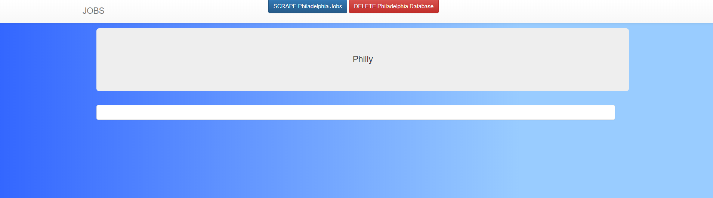
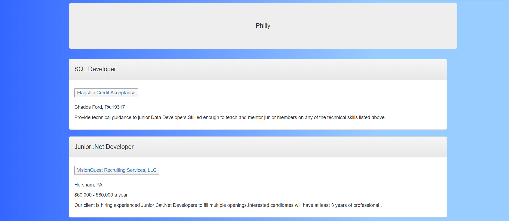

# JobScraper

## About the Application
This application scrapes available job listings on both Angel List and Indeed for junior developer positions. It makes it easier to search and apply for the available jobs. Each position lists location, title, company, and salary (if listed). So far the searches are limited to the Philadelphia and Houston markets, but a little tweaking in the Server.js file allows for a wider range of geographical locations. This application only runs locally.

## To Run Locally
* Clone this Repository
* Open in the Terminal
* Run "npm install" at the root of this application
* Run "node server.js"

<h1>Layout:</h1>
<ol>
<li><strong>User-Friendly Layout</strong></li>
<ul>
    <li>Easy to navigate</li>
    <li>Simple buttons</li>
</ul>

<li><strong>Front End</strong></li>
    <ul>
        <li>Stream-lined structure</li>
            <ol>
                <li>Clearly displays open positions</li>
                <li>Each position has an apply button that links to the application page</li>
            </ol>
    </ul>
<li><strong>Back End</strong></li>
    <ul>
        <li>Web Scraper</li>
        <ol>
            <li>Uses Cheerio to scrape open data from Indeed.com</li>
            <li>Stores scraped data to Mongoose database</li>
        </ol>
        <li>Axios</li>
        <ol>
            <li>Makes axios calls to the database for CRUD methods</li>
        </ol>
         <li>Express</li>
      <ol>
         <li>handles all of our http requests and responses</li>
         <li>backbone of our api and html routing</li>
      </ol>
    </ul>

 
 

<h1>Demo:</h1>

<ol>

<li>Click the 'SCRAPE Philadelphia Jobs' button to begin</li>

 
 
 

<li>Refresh the page to display the current job openings</li>

 
 
 

<li>To make a new search, Click the 'DELETE Philadelphia Jobs' button to clear the database, then click the 'SCRAPE' button again</li>

</ol>

## Technologies Used
* Cheerio
* Axios
* Express 
* Morgan Logger
* MongoDB
* Express-Handlebars
